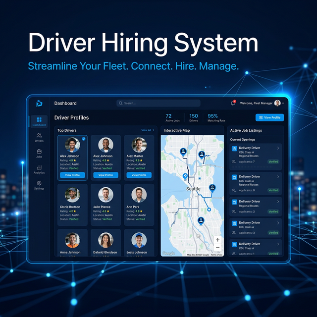

# 🚚 Driver Hiring System

[](https://opensource.org/licenses/ISC)
[](https://reactjs.org/)
[](https://nodejs.org/)
[](https://www.mongodb.com/)
[](https://tailwindcss.com/)



A comprehensive, production-grade MERN stack application designed to bridge the gap between skilled drivers and recruiters. The platform offers a seamless experience for job posting, application tracking, and profile management for drivers, recruiters, and administrators.

---

## ✨ Key Features

### 👤 For Drivers
- **Professional Profiles**: Create and manage detailed profiles with experience, license details, and preferences.
- **Job Search & Filtering**: Search for driving jobs based on location, type, and salary.
- **Easy Applications**: Apply to jobs with a single click and track application status.
- **Dashboard**: personalized view of applied jobs and profile insights.

### 🏢 For Recruiters
- **Job Management**: Post, update, and manage job listings with ease.
- **Applicant Tracking**: View detailed profiles of applicants and manage their hiring status.
- **Company Profile**: showcase your company to attract the best talent.
- **Analytics**: Get insights into job performance and applicant quality.

### 🛡️ For Administrators
- **User Management**: Overview of all drivers and recruiters on the platform.
- **Content Moderation**: Review job posts and profiles to maintain platform integrity.
- **System Insights**: Monitor platform growth and user activity.

---

## 🚀 Tech Stack

### Frontend
- **Framework**: [React.js](https://react.dev/) (Vite)
- **State Management**: [Zustand](https://github.com/pmndrs/zustand)
- **Styling**: [Tailwind CSS](https://tailwindcss.com/)
- **Icons**: [Lucide React](https://lucide.dev/), [React Icons](https://react-icons.github.io/react-icons/)
- **Routing**: [React Router DOM](https://reactrouter.com/)

### Backend
- **Environment**: [Node.js](https://nodejs.org/)
- **Framework**: [Express.js](https://expressjs.com/)
- **Database**: [MongoDB](https://www.mongodb.com/) (using [Mongoose](https://mongoosejs.com/))
- **Authentication**: [JSON Web Tokens (JWT)](https://jwt.io/) & [Bcrypt.js](https://github.com/dcodeIO/bcrypt.js)
- **File Uploads**: [Multer](https://github.com/expressjs/multer)

---

## 🛠️ Getting Started

### Prerequisites
- Node.js (v18 or higher)
- MongoDB (Local or Atlas)
- npm or yarn

### Installation

1. **Clone the repository**
   ```bash
   git clone https://github.com/vivek3931/driver-hiring.git
   cd driver-hiring
   ```

2. **Backend Setup**
   ```bash
   cd backend
   npm install
   ```
   - Create a `.env` file in the `backend` directory:
     ```env
     PORT=5000
     MONGO_URI=your_mongodb_uri
     JWT_SECRET=your_secret_key
     NODE_ENV=development
     ```
   - Start the backend server:
     ```bash
     npm run dev
     ```

3. **Frontend Setup**
   ```bash
   cd ../frontend
   npm install
   npm run dev
   ```

The application will be available at `http://localhost:5173`.

---

## 📂 Project Structure

```text
driver-hiring/
├── backend/            # Express Server & API
│   ├── controllers/    # Request handlers
│   ├── models/         # Mongoose schemas
│   ├── routes/         # API endpoints
│   ├── middleware/     # Auth & Error handling
│   └── uploads/        # Stored images/files
└── frontend/           # React Application
    ├── src/
    │   ├── components/ # Reusable UI components
    │   ├── pages/      # View components
    │   ├── store/      # Zustand state management
    │   └── assets/     # Static assets
    └── public/         # Publicly served files
```

---

## 🛣️ API Reference

| Endpoint | Method | Description |
| :--- | :--- | :--- |
| `/api/auth/register` | `POST` | Register a new user |
| `/api/auth/login` | `POST` | Authenticate user & get token |
| `/api/jobs` | `GET` | Get all job listings |
| `/api/jobs` | `POST` | Create a new job (Recruiter) |
| `/api/applications` | `POST` | Apply for a job (Driver) |
| `/api/driver/profile` | `GET` | Get driver profile data |

---

## 📄 License

This project is licensed under the [ISC License](LICENSE).

---

<p align="center">Made with ❤️ for Upendra the Driving Community</p>
